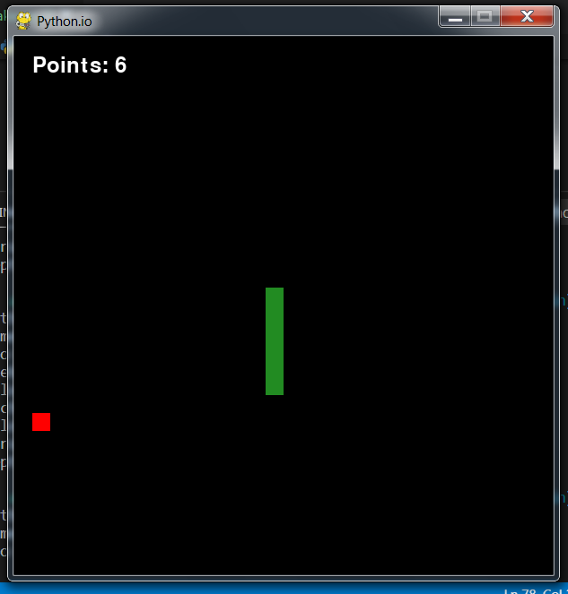

<center> 

</center>

---

# Python.io

  Snake Game made in Python and Pygame during the Kenzie Academy development week.

<p align="center">
  <a href="#install">Install</a>&nbsp;&nbsp;&nbsp;|&nbsp;&nbsp;&nbsp;
  <a href="#run">Run Game</a>&nbsp;&nbsp;&nbsp;|&nbsp;&nbsp;&nbsp;
  <a href="#how">How Play Game</a>&nbsp;&nbsp;&nbsp;|&nbsp;&nbsp;&nbsp;
  <a href="#shots">Screenshots</a>&nbsp;&nbsp;&nbsp;|&nbsp;&nbsp;&nbsp;
  <a href="#technologies">Technologies</a>&nbsp;&nbsp;&nbsp;|&nbsp;&nbsp;&nbsp;
  <a href="#goals">Goals</a>&nbsp;&nbsp;&nbsp;|&nbsp;&nbsp;&nbsp;
  <a href="#contributors">Contributors</a>&nbsp;&nbsp;&nbsp;|&nbsp;&nbsp;&nbsp;
  <a href="#licence">Licence</a>&nbsp;&nbsp;&nbsp;
</p>

<h2 id="install">:computer: Install</h2>

Clone the repository and install the dependencies.

```bash
# To clone the repository
git clone https://github.com/YujiYashima/Python.io.git

# g=Go into the folder
cd Python.io/

# Install the pygame
pip install pygame

```

<h2 id="run">:arrow_forward: Run Game</h2>

Instruction to run the game.

```bash
# Go to into Game Folder
cd game/

# Execute Game
python snake.py 
```

<h2 id="how">:video_game: How Play Game</h2>

To play the game, just use the __arrow keys__ on the keyboard or use the __A - W- S - D keys__ to move the snake.

| Up | Down | Right | Left |
| :---: | :---: | :---: | :---: |
| :arrow_up: | :arrow_down: | :arrow_right: | :arrow_left: |
| *W* | *S* | *D* | *A* |

Get points by eating the apples and be careful not to hit the wall!!

<h2 id="shots">:camera: ScreenShots</h2> 

<center>
    
</center><br>

<center>
    
</center><br>

<h2 id="technologies">Technologies</h2> 

This project was developed with the following technologies:

- [Python](https://www.python.org/)
- [Pygame](https://www.pygame.org/wiki/GettingStarted)

<h2 id="goals">Goals</h2> 

- Get experience;
- Learn Python from 0 and know how to work in a team with him;
- Network with the community;
- Work with a language library;
- Learn programming logic with the language;

<h2 id="contributors">Contributors and Contributions</h2>

- Creator: [Yuji Yashima](https://github.com/YujiYashima)

- [List of all contributors](https://github.com/YujiYashima/Python.io/graphs/contributors)

<h2 id="licence">Licence</h2> 

[MIT](https://github.com/YujiYashima/Python.io/blob/main/LICENSE)

